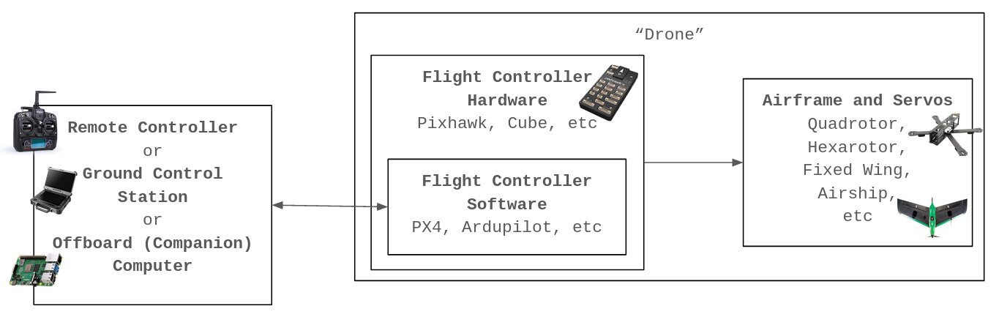

# Drone Fuzzing Research Project

## 1. Background

A "Drone" System is make up of 3 fundamental components: 1) Airframe that comprises the rotors and servos that propels the physical drone, 2) Flight Controller where the Hardware side sends electrical signals to the Airframe and the Software side is the brain that controls the behavior of the drone, and 3) the Remote Controller/ Ground Control Station/ Offboard Computer that talks to the Flight Controller for manual control or execution of autonomous tasks.

---

## 2A. Experiment Set Up (Ubuntu)

Our experiment is conducted using a simulation environment where the virtual represetation of the drone along with its Flight Controller is simulated by Gazebo Simulator and the Offboard application is a Python application that talks to the Flight Controller using the MAVLink protocol.

Ground Control Station (QGroundControl) needs to be running throughout the simulation.

### 1) Update Dependencies

This is an essential step to update packakges inside your Ubuntu Linux (20.04.4 LTS) system before installing anything:

`sudo apt update`

`sudo apt upgrade`

Otherwise, the Ubuntu's outdated packages may cause errors in the future steps. 

### 2) Gazebo Simulator

The currently used Gazebo Simulator version is 11.10.2. It is installed automatically when configuring the PX4 Flight Controller inside the Ubuntu Development Environment.

**Optional:** To install Gazebo independently, you may follow the "Alternative Installation" approach via in this [link](https://classic.gazebosim.org/tutorials?tut=install_ubuntu).

### 3) QGroundControl

Install necessary dependencies for video streaming:

`sudo apt-get remove modemmanager -y`

`sudo apt install gstreamer1.0-plugins-bad gstreamer1.0-libav gstreamer1.0-gl -y`

`sudo apt install libqt5gui5 -y`

Add the current user to `dialout` group and then logout and log back in to for the change to the user permissions to take effect:

`sudo usermod -a -G dialout $USER`

Download the AppImage of QGroundControl software from the repo and add executive permission to the file, then run the file:

`chmod +x ./QGroundControl.AppImage`

`./QGroundControl.AppImage `

**Note:** If you are using Ubuntu 22.04 LTS with [a workaround](https://askubuntu.com/questions/1404059/wpa2-wifi-refuses-to-connect-after-upgrade-to-22-04) implemented to circumvent the bug in the kernel with enterprise Wifi connections, the QGC app won't be able to start due to the SSL routines being tempered with. You have to downgrade the OpenSSL 3.0 to 1.1.1 following [these steps](https://linuxpip.org/install-openssl-linux/), and run `export QT_QPA_PLATFORM=xcb` in terminal. 

### 4) Create Python virtual environment

Create a Python Virtual environment with `python3 -m venv drone-env` to neatly organize python modules for this project.

Afterwards, run `source drone-env/bin/activate` in terminal to activate the environment, and use `pip3 install -r` to install dependencies from `requirements.txt`.

### 5) Install and Simulate ArduPilot Flight Controller

Clone the [ArduPilot Repository](https://github.com/ArduPilot/ardupilot/tree/c1e0e9c305ace7cab0972f27110442a4918a21bf): 

`git clone https://github.com/ArduPilot/ardupilot/tree/c1e0e9c305ace7cab0972f27110442a4918a21bf`

`cd ardupilot`

`git submodule update --init --recursive`

Then run the **install-prereqs-ubuntu.sh** inside the cloned repository to install related dependencies:

`Tools/environment_install/install-prereqs-ubuntu.sh -y`

Then, log out and log back in for the changes to take effect.

<!-- After installing the prerequisites, building the ArduPilot Flight Controller (for Pixhawk2/Cube) using [WAF](https://waf.io/) Build System as follows:

`./waf configure --board CubeBlack`

`./waf copter` -->

After building, you can run the simulation by the Gazebo simulator seperately and then running the  ArduPilot Flight controllers (in separate Terminal windows):

`gazebo --verbose worlds/iris_arducopter_demo.world`

`cd ~/ardupilot/ArduCopter`

`../Tools/autotest/sim_vehicle.py -f gazebo-iris --console --map`

---
